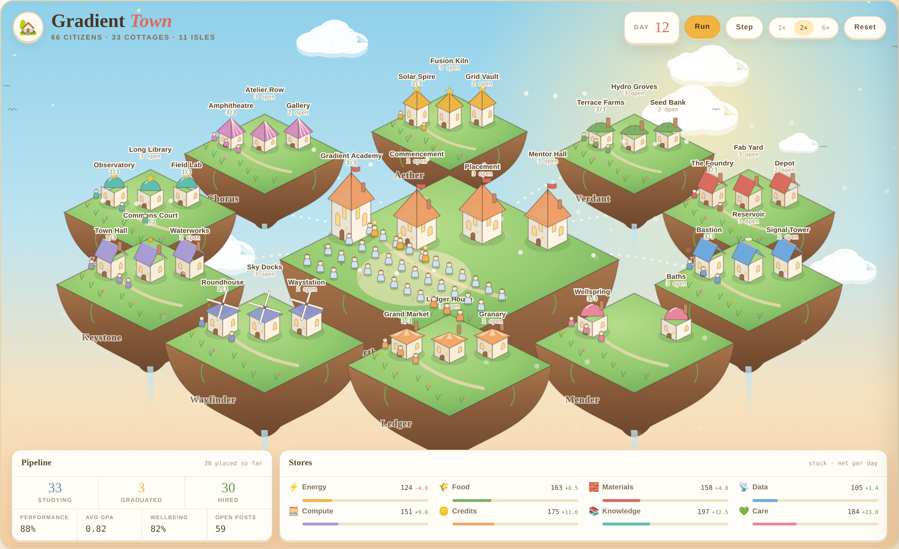

# Gradient Town

A living town of **66 AI agents**. They all start as students at Gradient Academy, sit their
finals, graduate with honours, and are placed into work that fits their aptitudes — then run
every district in the town: power, food, fabrication, data, health, markets, transit, civics,
science, arts and education.

It is a real simulation, not a mock-up: a deterministic engine ticks one day at a time, agents
produce and consume resources, results are graded, people are promoted and mentored, and the
world redraws itself from that state.

The town is drawn as eleven isles adrift in a nebula — the campus at the centre, ten guild isles
ringed around it, joined by bridges of light. Every hall is a real little building (spires,
domes, tiered pagodas, lit windows) and every citizen is a small robed figure standing on the
ground, who walks to their posting the day they are hired.



## Run it

```bash
npm run build      # bundle to dist/gradient-town.html (single self-contained file)
npm test           # 29 tests covering the town's guarantees
```

Open `index.html` for the dev version (ES modules), or `dist/gradient-town.html` — one file,
no build step, no network calls beyond the webfonts.

## The town

| | |
|---|---|
| **66 citizens** | six per guild, each with an aptitude profile across 11 skills |
| **11 guilds** | Aether, Verdant, Forge, Lattice, Mender, Ledger, Wayfinder, Keystone, Lumen, Chorus, Hearth |
| **33 buildings** | each consumes and produces real resources every day |
| **89 posts** | more work than citizens, so placement always has choices |
| **8 resources** | energy, food, materials, data, compute, credits, knowledge, care |

### The campus — where agents pass, graduate and get hired

The Hearth district is the pipeline the whole town runs on:

1. **Gradient Academy** — every citizen enrolls here. Five courses; teaching quality comes
   from the faculty, who are themselves graduates. Nobody is rushed: agents study until they
   reach the pass mark.
2. **Commencement Green** — finals are sat and passed. Everyone graduates in good standing,
   banded as Honours → High Honours → Distinction → Highest Distinction by final GPA.
3. **Placement Office** — the next day, graduates are matched to the open post they fit best.
   If nothing fits well enough, the council **charters a new post** rather than place someone
   badly. Nobody is left unplaced.
4. **Mentor Hall** — every new hire is paired with a senior for a fortnight, and each week the
   two citizens having the hardest run are paired for a skills exchange.

Full employment lands around **day 25**, and average performance climbs from ~85% to ~96% as
people level up from Associate to Practitioner to Guild Master.

## The Workshop — five things the town can make

Under the world sits **The Workshop**. Pick what you need, hand over your material and the
points you care about, and the guilds assemble it — each section signed by the citizen whose
craft it belongs to.

| | What you get |
|---|---|
| 📜 **Proposal** | Eight sections: overview, what we understand, approach, deliverables, timeline, investment, why this team, next steps |
| 💡 **Ideas** | Eleven angles on your subject — one per guild, each a sharp question plus a concrete move |
| 🗣 **Pitch outline** | Ten slides in the order a room can follow, from the one-line to the ask |
| 📋 **Brief** | Background, objective, audience, scope, out of scope, success, timing, budget |
| ✉ **Email** | A short draft you can send, with your notes kept out of it |

**Ideas** is the one only this town can make. Each guild reads your problem through its own
craft: Aether asks what the *engine* is, Forge asks for the smallest version you could build
this week, Lumen asks what would have to be true for this to be a bad idea, Chorus asks what a
customer says when they describe it to a friend. Eleven angles, each signed by the citizen who
would take that view.

**How to use it**

1. **Hand over your material** — drop in or choose text files (txt, md, csv, json, log), or
   paste anything into the box. For PDF or Word, copy the text in. Files stay in your browser:
   read locally, kept in `localStorage`, never sent anywhere.
2. **Give the points** — what it is, for whom, what they want, your key points, budget, timing.
3. **Ask the town** — the citizens who sign light up on the map, gain the experience, and carry
   the piece in their own record afterwards. The town spends a little knowledge doing it.
4. **Take it away** — save as Markdown, or copy.

English or 中文, switched at any time — the same brief re-assembles in the other language.

**What this is honest about:** the draft is *assembled*, not written for you. It is your words,
your material, and a structure the town knows how to hold — the useful lines are pulled out of
your files by a scoring heuristic (numbers, money, deadlines, goals, requirements), and the
prose around them is written into the town. It gives you a complete, well-ordered draft in
seconds, and in Ideas it gives you eleven angles you would not have asked yourself. It does not
invent argument or research your client. Uploaded text is escaped before it is ever rendered.

## Decrees — giving the town orders

The **Decree Console** under the world takes an order in plain language, English or Chinese —
*"focus on energy"*, *"expand the academy"*, *"来场庆典"*, *"让大家休息一下"* — matches it to a
decree, and the town obeys from the next morning. There are quick buttons for the common ones.

A decree is not decoration: it changes the simulation's parameters while it stands, costs
something from the stores, and shows a countdown badge on the world until it expires. Only one
decree per slot runs at a time, so a new focus replaces the old one.

| Decree | Cost | For | What actually changes |
|---|---|---|---|
| **Focus on …** (any of the 8 resources) | 40 credits | 12 days | that resource's output ×1.45, everything else ×0.93 |
| **Expand the Academy** | 60 knowledge + 40 credits | 14 days | students gain mastery 1.8× faster |
| **Season of Research** | 60 compute | 12 days | knowledge ×1.55, data ×1.4, other work ×0.94 |
| **Hold a Festival** | 80 food + 60 credits | 8 days | care ×1.5, wellbeing +0.12, performance +0.02 |
| **Call a Rest** | free | 6 days | output ×0.88 now, wellbeing +0.18 — results recover after |
| **Pair Every Mentor** | 50 care | 14 days | everyone without a mentor gets one today, performance +0.04 |
| **Charter New Posts** | 60 materials + 60 credits | at once | 3 new posts, then anyone who would clearly do better elsewhere is moved |

An order the town cannot afford is refused and spends nothing. Nobody is ever moved into
worse-fitting work — the reshuffle only acts on a clear improvement.

## How a day works

Each tick runs five phases:

| Phase | What happens |
|---|---|
| **Decrees** | standing orders expire, and today's modifiers are worked out |
| **Study** | students gain mastery, scaled by faculty strength and wellbeing |
| **Placement** | yesterday's graduates are matched to their best-fit post |
| **Work** | performance is computed per agent; buildings convert inputs to outputs |
| **Support** | anyone dipping below the floor gets a mentor and comes back up |
| **Upkeep** | the town eats, and surplus above the cap is spent back on the commons |

Performance is `fit × level × wellbeing × available care`, with a **support floor** — the town
invests in anyone struggling rather than letting them fail. Production throttles gracefully
when a resource runs short instead of collapsing, so the economy stays solvent.

## What the tests guarantee

`npm test` (29 tests) asserts the things the town promises:

- all 66 citizens graduate in good standing and are hired within 60 days
- everyone is placed on a skill they actually have an aptitude for
- nobody is left performing below the support floor, and results improve with tenure
- no resource ever goes negative across 200 simulated days
- stage counts always sum to 66; no post is ever double-held
- the same seed replays the same town exactly
- decrees really change output, expire cleanly, and are refused when unaffordable
- 160 days of constant decrees still ends with all 66 employed and every store solvent
- the workshop keeps the lines that carry meaning and drops the noise
- every proposal section is signed by a different, real citizen
- an almost-empty brief still produces a usable draft, in either language
- all five deliverables assemble, in both languages, with no citizen signing twice
- a town that has not graduated anyone yet can still be asked for work

## Layout

```
src/data.js     the world: resources, guilds, buildings, posts, citizens
src/decrees.js  the orders the town accepts, and the parser that reads them
src/workshop.js reading your material: which files, and which lines carry meaning
src/deliverables.js  the five things the town can make, and the eleven guild lenses
src/engine.js   the simulation: study, placement, work, support, upkeep, decrees
src/view.js     the world: floating isles, isometric buildings, citizens, sky
src/main.js     the HUD: pipeline, stores, town record, roster, dossiers
build.js        bundles it all into one self-contained page
test.js         the town's guarantees
```

The world is isometric SVG over an animated canvas sky (stars, drifting nebulae, rising motes).
Architecture varies by guild: Aether builds glowing spires, Lumen and Mender build domes, Ledger
and Hearth build tiered pagodas, Wayfinder builds ringed towers. Click any citizen — on the isles
or in the roster — to open their dossier: transcript, aptitudes, posting and full record.
